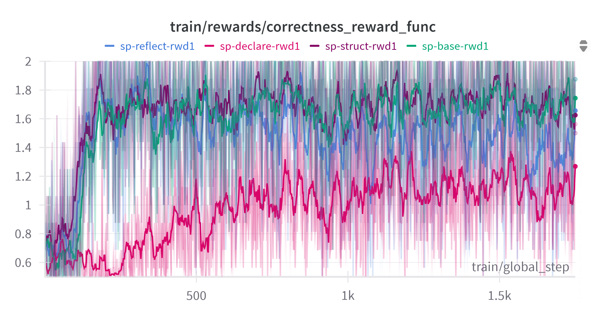

This repository contains the code for Niklas Mellgren's 2025 master's thesis in Data Science – ICT Systems at the University of Southern Denmark (SDU).

### **Thesis title**  
**Reinforcement Fine-Tuning Large Language Models to Use Prolog as a Tool**  
*Awarded the highest grade (12) at the University of Southern Denmark, SDU*

### **Abstract**
Using Group Relative Policy Optimization (GRPO), this project fine-tunes Qwen2.5-3B-Instruct on a merged and cleaned version of `openai/gsm8k` and `Thomas-X-Yang/gsm8k-prolog`, resulting in the `niklasm222/gsm8k-prolog-prover` dataset.

During preprocessing, I identified and manually corrected 15 errors across the original datasets, 14 in `openai/gsm8k` and 1 in `Thomas-X-Yang/gsm8k-prolog`, to ensure accurate alignment between the natural language questions, numeric answers, and symbolic Prolog representations.

Three main experimental axes were explored:

1. **Prompt structure**: From minimal XML formatting to structured, declarative and reflexive, self-verifying scaffolds  
2. **Reward composition**: Combining execution correctness, syntax, semantic similarity, structural constraints, and curriculum shaping in three different reward suites
3. **Inference protocol**: Including single-shot, best-of-N multiple-try, and two agentic modes where Prolog is used as a tool inside dialogue (internal) or across fresh sessions (independent)

*Figure 1: Correctness reward progression during training across different system prompts under reward_suite_1. The LLMs `<answer>` block is executed using SWI-Prolog, and the numeric output is compared to a gold label. Exact matches receive a score of 2.0, incorrect but numeric outputs earn 1.0, and any runnable attempt - even with unbound variables or failures - earns 0.5.*

### Key findings
- Joint tuning of prompt, reward, and inference shapes the structure and quality of generated Prolog programs
- **Highest accuracy** on GSM8K was achieved using external Prolog verification in a best-of-N multiple-try setting
- **Best zero-shot generalization** (MMLU-STEM/Pro) came from agentic inference, where the model engages in self-repair using Prolog as an interactive tool

### Why this matters
This project moves us closer to transparent and testable AI reasoning by:

- Converting instructional LLMs into reasoning models through reinforcement learning, using GRPO to enforce **explicit reasoning** in `<reasoning>` blocks and generate **symbolic Prolog programs** inside structured `<answer>` blocks
- Leveraging **SWI-Prolog** not only as a static verifier, but also as an interactive tool, invoked via function-calling — exploring how lightweight **AI agents** can reason, self-repair, and validate their own output in a dialogue loop
- Reinforcing behavior that leads to reasoning and answers that are **verifiable, falsifiable, and logically grounded**
